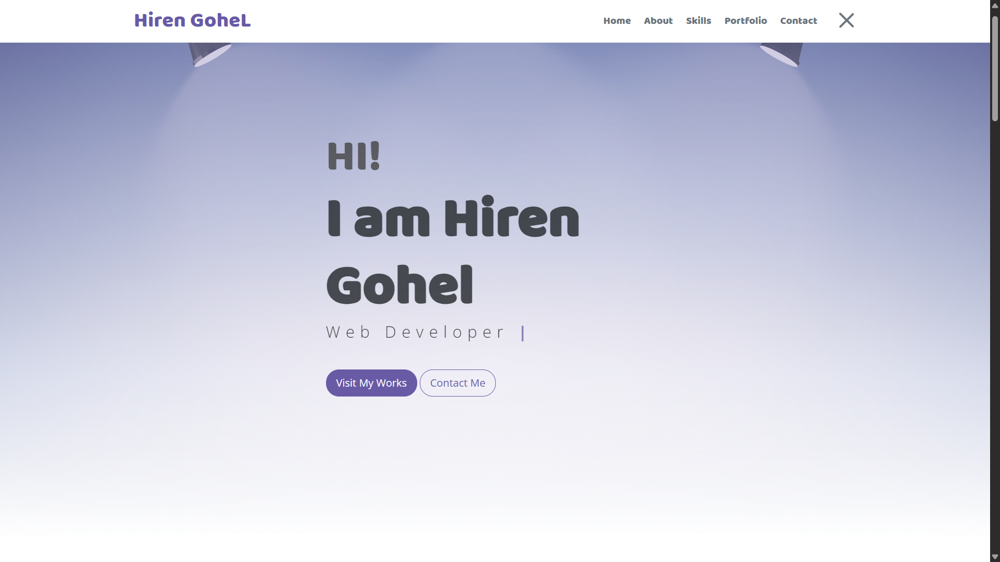

# Hiren Gohel Portfolio

This is a personal portfolio website for **Hiren Gohel**, showcasing skills, education, projects, and contact information.

## 🚀 Features

- Modern, responsive design
- Animated typing effect for professional titles
- Skills and technology stack section
- Education timeline
- Live project portfolio with links and images
- Contact form with WhatsApp integration
- Social media links (WhatsApp, LinkedIn, Instagram, GitHub, etc.)
- Custom themed footer

## 🛠️ Built With

- HTML5, CSS3 (custom & Bootstrap)
- JavaScript
- Font Awesome & Themify Icons

## 📂 Sections

- **Home:** Introduction and animated professional titles
- **About:** Brief bio and CV download
- **Skills:** Technical skills and tools
- **Education:** Academic background
- **Portfolio:** Live project showcase
- **Contact:** Form to send messages directly to WhatsApp
- **Footer:** Social links and copyright

## 🌐 Live Demo

[https://hirengohelofficial.me/](https://hirengohelofficial.me/)

## 📸 Screenshots

## 📞 Contact

- WhatsApp: [+91 9327156147](https://wa.me/919327156147)
- LinkedIn: [hiren-gohel-6986a124b](https://in.linkedin.com/in/hiren-gohel-6986a124b)
- Instagram: [@hirengohelofficial](https://www.instagram.com/hirengohelofficial/)
- GitHub: [GohelHiren](https://github.com/GohelHiren)
- Email: [hirengohel5173@gmail.com](mailto:hirengohel5173@gmail.com)

---

> **Made with ❤️ by Hiren Gohel**# Hiren Gohel Portfolio

This is a personal portfolio website for **Hiren Gohel**, showcasing skills, education, projects, and contact information.

## 🚀 Features

- Modern, responsive design
- Animated typing effect for professional titles
- Skills and technology stack section
- Education timeline
- Live project portfolio with links and images
- Contact form with WhatsApp integration
- Social media links (WhatsApp, LinkedIn, Instagram, GitHub, etc.)
- Custom themed footer

## 🛠️ Built With

- HTML5, CSS3 (custom & Bootstrap)
- JavaScript
- Font Awesome & Themify Icons

## 📂 Sections

- **Home:** Introduction and animated professional titles
- **About:** Brief bio and CV download
- **Skills:** Technical skills and tools
- **Education:** Academic background
- **Portfolio:** Live project showcase
- **Contact:** Form to send messages directly to WhatsApp
- **Footer:** Social links and copyright

## 🌐 Live Demo

[https://hirengohelofficial.me/](https://hirengohelofficial.me/)

## 📸 Screenshots

## 📞 Contact

- WhatsApp: [+91 9327156147](https://wa.me/919327156147)
- LinkedIn: [hiren-gohel-6986a124b](https://in.linkedin.com/in/hiren-gohel-6986a124b)
- Instagram: [@hirengohelofficial](https://www.instagram.com/hirengohelofficial/)
- GitHub: [GohelHiren](https://github.com/GohelHiren)

---

> **Made with ❤️ by Hiren Gohel**
